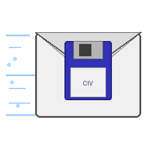

# Civ4 PBEM Manager v5.0

<p align="center">
  
</p>

<p align="center">
  <strong>Stop clicking through menus. Start playing.</strong>
</p>

---

## What is this?

Civilization 4: Beyond the Sword is a 20-year-old game with no built-in online multiplayer infrastructure worth speaking of. Yet thousands of people still play it — passing save files back and forth by email, Discord, or shared folders, manually tracking whose turn it is, manually launching the game, manually notifying the next player.

**Civ4 PBEM Manager** automates all of that.

You play your turn. The app detects the save, uploads it to your shared server, and emails (or pings via the app itself) the next player. They download it, launch Civ4, and play. No spreadsheets. No "hey did you get my save?" messages. No forgotten turns sitting in someone's inbox for a week.

It was built entirely by AI (Claude / Kiro) as pure vibecoding for fun. The human provided the vision, tested the builds, and kept the AI on track. The AI wrote every line of code.

---

## What it does

### The core loop
- Watches your Civ4 save folder for new saves
- Uploads them to a shared server (FTP, SFTP, WebDAV, or Email)
- Notifies the next player — via email (SMTP) or directly through the app (no SMTP needed)
- Downloads saves when it's your turn
- Launches Civ4 with the right save, optionally loading it directly

### Everything else
- **Multi-game**: manage as many parallel PBEM games as you want
- **Multi-edition**: Steam, GOG, DVD — each with its own path and launch method
- **Direct save loading**: `/fxsload=` parameter skips the main menu entirely
- **File association**: set Windows to open `.CivBeyondSwordSave` files with your preferred edition
- **Turn history**: full log of every turn, with revert capability
- **Game statistics**: who plays fastest, who takes the longest, average turn times
- **Turn calendar**: shows in-game year (4000 BC → 2050 AD) everywhere in the UI
- **Reminder system**: nudge the current player manually or automatically after X days
- **In-app notifications**: flag files on the transport server — works without any email setup
- **Encrypted config**: master password protects your server credentials on disk (AES-256)
- **Export/Import**: share a `.civ4pbem` file **or an invite code** (paste on Discord) — they import it and are ready to go
- **Player roster**: mark players defeated or resigned; the turn queue skips them
- **Winner**: auto-declared when one active player remains, or set in Edit Game
- **Polish / English UI**: runtime language switching, no restart needed
- **Dark / Light theme**: because some of us play at night
- **Tray badge**: persistent reminder when someone is waiting on your turn

---

## What it does NOT do

This is important. The app is a **coordinator**, not a game client.

- ❌ It does not modify Civ4 in any way
- ❌ It does not host a game server
- ❌ It does not handle simultaneous turns (hotseat only, not true multiplayer)
- ❌ It does not work with mods that change the save format in incompatible ways
- ❌ It does not guarantee `/fxsload=` works on your system — this depends on your Windows version, Civ4 version, and registry state. It works on most setups but not all.
- ❌ It does not send notifications if you haven't configured a transport (you need somewhere to put the files)
- ❌ It does not replace the need for all players to have the same mods installed
- ❌ It is not a replacement for Pitboss or any real multiplayer infrastructure

---

## Download

**Windows .exe** is available in [Releases](https://github.com/zfkibuj-hash/CIV_PBEM/releases) -- no Python installation needed.

Just download `Civ4PBEMManager.exe` and run it.

1. Run the app → **Settings → General**
2. Set your player name, email, save folder path
3. Configure your Civ4 installation (Steam / GOG / DVD)
4. **+ New Game** → add players in turn order → select game speed
5. **Game transport...** → configure your shared server
6. **Export** the `.civ4pbem` file, or **Copy invite code** → send it to other players
7. Other players **Import** / **Paste invite code** → pick their identity → done

After setup: play your turn in Civ4 → watchdog detects the save → uploads → notifies next player → they download and play.

---

## Installation

```bash
pip install -r requirements.txt
python main.py
```

### Build standalone .exe (Windows)

```bash
build.bat
```

Output: `dist/Civ4PBEMManager.exe` (~28 MB)

### Requirements

- Python 3.10+
- PySide6 >= 6.5
- paramiko >= 3.0
- watchdog >= 3.0
- cryptography >= 41.0
- PyInstaller >= 6.0 (build only)

---

## Features at a glance

| Feature | Details |
|---|---|
| Transport | FTP, SFTP, WebDAV, Email (per-game) |
| Notifications | In-app flag files (default) + optional SMTP |
| Launcher | Steam / GOG / DVD, direct save load |
| Languages | Polish, English (runtime switch) |
| Security | AES-256 encrypted credentials |
| History | Full turn log, revert to any turn |
| Roster | Active / defeated / resigned; winner |
| Join | `.civ4pbem` file or invite code |
| Statistics | Per-player times, averages |
| Calendar | In-game year display |
| Reminders | Manual + auto after X days; tray badge |

---

## Changelog

### v5.0.0

**Roster, winner, and safer identity**
- Player status: **active / defeated / resigned** — the turn queue skips inactive players
- **Winner**: auto-declared when exactly one active player remains; can also be set in Edit Game
- Finished games show a gold banner and hide Play Now
- Roster changes (defeated / resigned / revived / won) notify other players via in-app flags (and SMTP if you enabled it)
- Changing status or winner requires the **admin password**
- Defeated/resigned status is kept when pulling `{game}.config` / `state.json` from the server (it used to be dropped)

**Join and identity**
- **Invite codes** — copy/paste a game join string (Discord/Messenger) instead of sending a `.civ4pbem` file
- Player nick is required (wizard Skip without a name no longer finishes setup; Settings refuse an empty nick)
- Duplicate-alias warning when another install already claimed that player slot (`install_id` + `player_claims`)
- Game-name matching is token-based: `Rome` no longer matches `Rome2` or `Rome_Extra`

**Notifications and UI**
- In-app notifications **on** by default; SMTP email **off** by default (you can still enable it)
- Persistent **tray badge** when it is your turn
- UI on **PySide6** (was PyQt5)

**Fixes**
- Background Check/upload workers no longer get garbage-collected (silent hangs / “Check stuck”)
- Empty player name never counts as “your turn”
- Native Civ4 save scan uses the same game-name token rules as managed saves

FTP remains the production transport (SFTP / WebDAV / Email still available). No extra cloud or P2P service is required.

### v4.4.0
- Managed saves: monotonic `NNNN_` sequence prefix + existing `T####` round number
  (`0003_MyGame_T0001_from_A_to_B.CivBeyondSwordSave`); legacy names still work
- Newest save chosen by sequence (not string/turn alone) — fewer turn-order glitches
- Check/download also when the newest remote save is addressed to you (stale local state)
- Case-insensitive player name matching for turns / save routing
- Revert rewinds save_seq (back to #17 → next upload is #18) and keeps that save on the server
- Check status bar phases (connecting / searching / downloading / summary)
- Fix: seq-prefixed local saves found for launch; already-local not treated as new download
- Fix: no UI reload mid-check; generation-safe Check unlock

### v4.3.0
- Per-game FTP/SFTP/WebDAV folders; email subjects include game name
- Delete all remote game files; revert cleans newer saves/flags on server
- One-click Play now (download + launch); optional auto-launch after check
- Upload validation (from/to / Civ4 `_to_Leader`); Civ4 leader field in edit game
- Launch uses newest local save (managed or native Civ4 name)
- Player-order chips with current highlight, wait time, overdue tint, brief pulse
- Removed misleading save-folder mismatch warning
- Unit tests for turn/save parsing and upload validation

### v4.2.0
- PBEM health check: status strip, tray alerts, plain-language diagnostics
- OS autostart at login (starts minimized to tray)
- Save folder picker: detected folders, "Use this", optional save count check
- Setup wizard: Civ4 auto-detect, preferred edition, /fxsload, import/new game/settings shortcuts
- Save naming `from_X_to_Y`, remote save delete, state sync and OneDrive save detection

### v4.1.0
- Email autodiscovery: detects server settings from email address (Mozilla autoconfig, Microsoft Autodiscover, DNS SRV, TCP probing)
- Provider presets: Gmail, Outlook/Hotmail/Live, Yahoo Mail, iCloud Mail
- App password warning for Gmail, Yahoo, and iCloud
- POP3 support alongside IMAP (fallback for servers without IMAP)
- Explicit security selection: SSL, STARTTLS, or none (separately for SMTP and IMAP/POP3)
- Option to delete emails after downloading a save file
- Reminder system: manual trigger plus automatic reminders after X days
- In-app notifications (flag files on the server, no SMTP required)
- Master switch for notifications plus two independent channels
- Email template editor with variable insertion buttons
- Fixed table readability in dark mode
- Fixed game title bar alignment in light mode

### v4.0.0
- Multi-edition launcher (Steam/GOG/DVD) with colored picker dialog
- Direct save loading via `/fxsload=` — confirmed working on Steam, GOG, DVD
- Windows file association manager (no admin rights needed)
- In-app notifications via transport flag files — no SMTP required
- Notification master switch + two independent channels
- Reminder button + auto-reminder after X days of inactivity
- Email template editor with one-click variable insertion
- Import game → optionally replace global transport/SMTP settings
- Simplified settings: one global direct-load checkbox

### v3.0.0
- Game statistics and turn calendar
- Auto-launch Civ4 with save
- Polish/English UI with runtime switching
- AES-256 encrypted config
- Single-instance guard
- Player alias mapping
- Turn revert with player notifications
- Edit game dialog

---

## 🇵🇱 Polski

### Po co to powstało?

Civilization 4 to gra sprzed 20 lat, która nie ma żadnej sensownej infrastruktury do gry przez internet. A mimo to tysiące ludzi nadal w nią gra — przesyłając save'y mailem, przez Discorda albo współdzielone foldery, ręcznie śledząc czyja tura, ręcznie uruchamiając grę, ręcznie powiadamiając następnego gracza.

**Civ4 PBEM Manager** automatyzuje to wszystko.

Grasz swoją turę. Aplikacja wykrywa save, wysyła go na serwer i powiadamia następnego gracza — mailem albo bezpośrednio przez aplikację. Oni pobierają save, uruchamiają Civ4 i grają. Bez arkuszy kalkulacyjnych. Bez "hej, dostałeś mój save?". Bez tur leżących zapomniane w czyjejś skrzynce przez tydzień.

### Czego to nie ogarnia?

Aplikacja jest **koordynatorem**, nie klientem gry.

- ❌ Nie modyfikuje Civ4 w żaden sposób
- ❌ Nie hostuje serwera gry
- ❌ Nie obsługuje jednoczesnych tur (tylko kolejkowe PBEM)
- ❌ Nie gwarantuje że `/fxsload=` zadziała na Twoim systemie — zależy od wersji Windows, wersji Civ4 i stanu rejestru
- ❌ Nie zastępuje konieczności posiadania tych samych modów przez wszystkich graczy
- ❌ Nie działa bez skonfigurowanego transportu (potrzebujesz miejsca na pliki)

### Szybki start

1. Uruchom → Ustawienia → podaj nick, email, folder save'ów
2. Ustawienia → Ogólne → skonfiguruj wersję Civ4 (Steam/GOG/DVD)
3. Nowa gra → dodaj graczy → wybierz prędkość → skonfiguruj transport
4. Eksportuj `.civ4pbem` **albo skopiuj kod zaproszenia** i wyślij innym graczom
5. Graj turę → watchdog automatycznie wyśle save i powiadomi następnego gracza

### Co nowego w v5.0

- Status gracza: **aktywny / pokonany / zrezygnował** — kolejka tur ich pomija
- **Zwycięzca**: automatycznie, gdy zostaje jeden aktywny gracz (albo ręcznie w Edytuj grę)
- Powiadomienia o zmianie składu (pokonany / rezygnacja / powrót / wygrana) przez aplikację
- **Kody zaproszeń** (Discord/Messenger) obok pliku `.civ4pbem`
- Badge w zasobniku, gdy ktoś czeka na Twoją turę
- SMTP wyłączony domyślnie; powiadomienia w aplikacji włączone
- Naprawione mylenie gier o podobnych nazwach (`Rome` vs `Rome2`)
- Ostrzeżenie, gdy ten sam nick jest już zajęty na innym komputerze
- Zmiana statusu / zwycięzcy wymaga hasła admina

Pełna instrukcja: **[MANUAL.md](MANUAL.md)**

---

## About

Built entirely by AI (Claude / Kiro LLM) as pure vibecoding for fun. The human provided the vision, tested the builds, and kept the AI on track. The AI wrote every line of code. The human has zero programming knowledge and cannot fix bugs or implement feature requests on their own.

You are welcome to report bugs and suggest features in the Issues tab. Just know that fixes depend on AI assistance, not a developer sitting behind the keyboard. If you know Python and want to contribute, pull requests are very welcome.

Free to use, modify, and redistribute. MIT License.
